#Zone设计方案测试

##Zone 设计目的

随着Nebula性能与稳定性的不断增强，在生产系统中承担的任务愈发重要，越来越多的重要数据被存储在Nebula中。用户在使用Nebula的过程中，期望将Space创建在某些指定的Storage节点上，从而达到资源隔离的目的。当集群需要滚动升级时，一般是取出一个或者多个服务器停止服务，执行更新，并重新将其投入使用，直到集群中所有的实例都更新成新版本，便于管理更新操作。为解决上述问题，Nebula将提供Zone功能.
****
##Zone 设计原则
1. Zone是一个Storage节点集合，每个Storage节点仅属于一个Zone，Zone中Storage节点不允许交叠。
2. 一个Zone中持有多个Part的副本，且同一个Part在一个Zone中只持有一个副本。
3. Group是一个Zone的集合，用于管理Zone，并进行资源隔离。创建Space时如果指定Group，该Space的副本将均匀分布在该Group上的各个Zone中。一个Group之中包含Space的所有分区的副本。同一个Zone可以属于多个Group。
4. 一个Group上可以创建多个Space。Group中Zone的数量需要大于等于与之关联的Space的最大副本数。例如有两个Space创建在Group-0之上，一个副本数为3，另一个副本数为5，则Group-0中Zone数量至少为5。
****
##服务器集群配置

- meta服务配置
  --serve_addrs:192.168.8.5
  --port：5885
- graph服务配置
  --meta_server_addrs:192.168.8.5:5885 
  --local_ip=192.168.8.5 
  --port=6996 
- storaege服务配置
  本文档预设了4个storage服务，其基本信息如下图所示：
  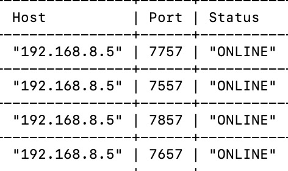
  

****
##ZONE 相关语句及其测试
****

###ADD ZONE

**含义:在指定集群上新增Zone**
**如果zone-name已存在或host列表为空，则添加失败**
**命令:ADD ZONE zone-name hosts-list**

####命令测试

**命令**
add zone zone1 192.168.8.5:7757
add zone zone2 192.168.8.5:7557,192.168.8.5:7657;
add zone zone3 192.168.8.5:7857

**执行后ZONE STATUS**
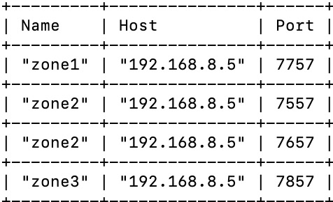
####DEBUG测试:选择不存在的节点新建ZONE

**命令**
add zone zone4 192.168.8.5:7777
**执行结果**
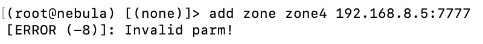

**ZONE STATUS** 

####DEBUG测试:选择已有的ZONE名字新建ZONE
**命令**
add zone zone1 192.168.8.5::7757

**执行结果**
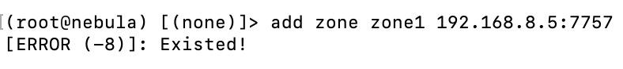

**ZONE STATUS** 

####DEBUG测试:在新建ZONE时host选择已有所属ZONE的节点

**命令**
add zone zone4 192.168.8.5:7757

**执行结果**
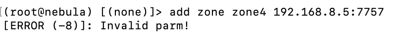

**ZONE STATUS** 

####DEBUG测试:在新建ZONE时不选择host

**命令**
add zone zone4 

**执行结果**
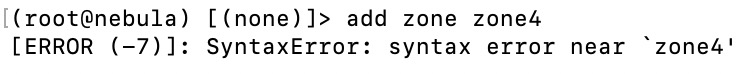

**ZONE STATUS** 

****
###DROP HOST FROM ZONE

####命令测试
drop HOST 192.168.8.5:7757 from zone zone1

**ZONE STATUS** 
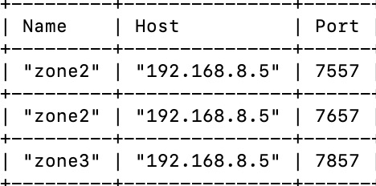
####DEBUG测试:DROP一个并不在ZONE中的节点

**命令**
drop HOST 192.168.8.5:6734 from zone zone2

**执行结果**
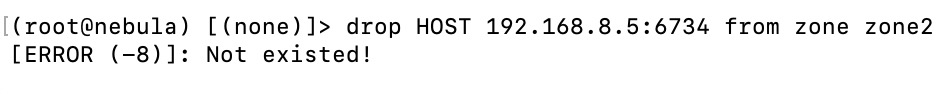

**ZONE STATUS** 

####DEBUG测试:DROP的节点在其他zone中

**命令**
drop HOST 192.168.8.5:7757 from zone zone2

**执行结果**
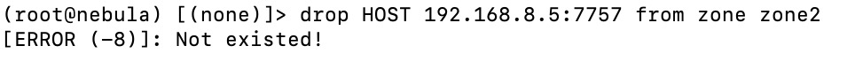

**ZONE STATUS** 

****
###ADD HOST INTO ZONE

####命令测试

add HOST 192.168.8.5:7757 into zone zone1

**ZONE STATUS** 

####DEBUG测试:add的节点不存在

**命令**
add HOST 192.168.8.5:234 into zone zone1

**执行结果**
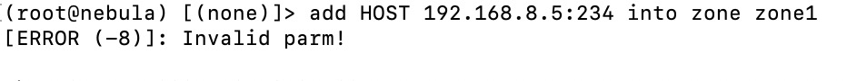

**ZONE STATUS** 

####  DEBUG测试:add的节点已在其他ZONE中

**命令**
add HOST 192.168.8.5:7557 into zone zone1

**执行结果**
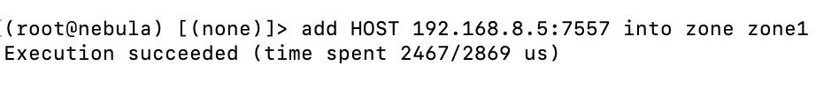

**ZONE STATUS** 
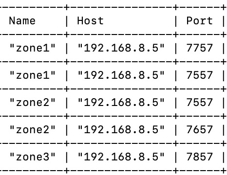
####DEBUG测试:add的ZONE不存在

**命令**
add HOST 192.168.8.5:7557 into zone zone4

**执行结果**
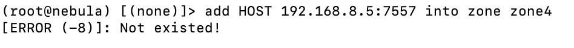

**ZONE STATUS** 

####DEBUG测试:ZONE中已存在目标host

**命令**
add HOST 192.168.8.5:7557 into zone zone2

**执行结果**
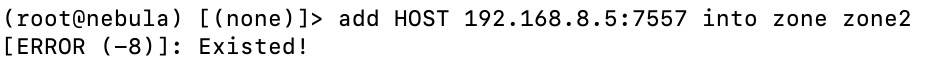

**ZONE STATUS** 

****

###ADD GROUP
**含义:新增Group（权限问题）
如果group-name已经存在，则添加失败。
如果zone列表为空或其中含有不存在的zone，则添加失败。
创建Group之后不允许修改，Replica不能修改，Zone数不会有变化。
命令:ADD GROUP group-name zone-names-list**

####命令测试

**命令**
 add group group1 zone1,zone2,zone3
 add group group2 zone1,zone2
 add group group3 zone1,zone3

**执行结果**
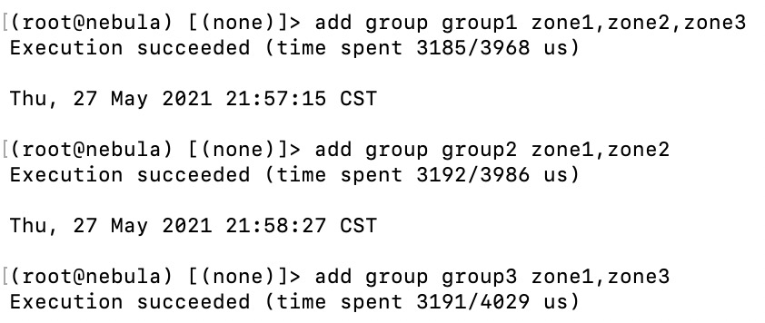

**GROUP STATUS** 

####DEBUG测试:选择不存在的ZONE新建GROUP

**命令**
add group group4 zone4

**执行结果**
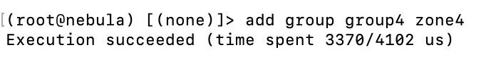

**GROUP STATUS** 
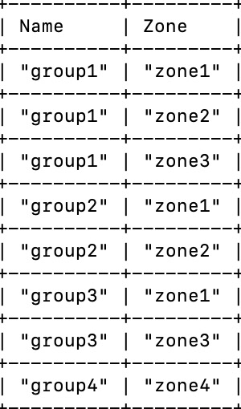

**ZONE STAUS**

####DEBUG测试:选择已有的GRORP名字新建GROUP

**命令**
add group group2 zone1,zone2

**执行结果**
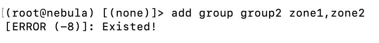

**GROUP STATUS** 
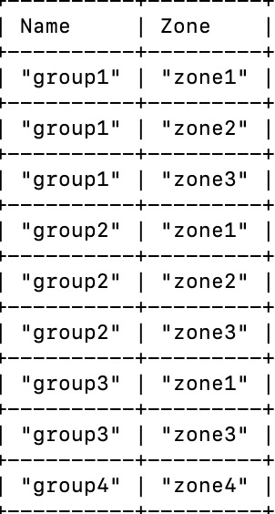
####DEBUG测试:新建GROUP时，有部分ZONE不存在

**命令**
add group group6 zone10086,zone1,zone2

**执行结果**
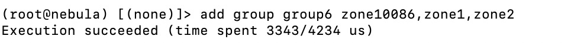

**GROUP STATUS** 
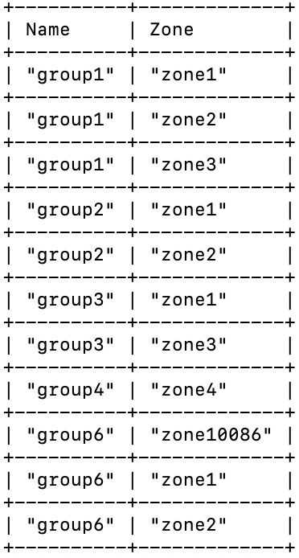
####DEBUG测试:在新建GROUP时不选择ZONE

**命令**
add group group5 

**执行结果**
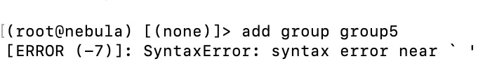

**GROUP STATUS** 

###ADD ZONE INTO GROUP 

####命令测试

**命令**
add zone zone3 into group group2
 

**GROUP STATUS** 

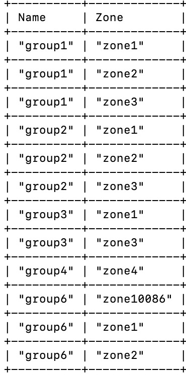
####DEBUG测试:add的zone不存在

**命令**
add zone zone10086 into group group2

**执行结果**
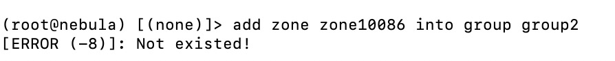

**GROUP STATUS** 
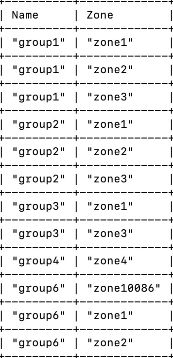

####DEBUG测试:add的GROUP不存在

**命令**
add zone zone1 into group group10086

**执行结果**
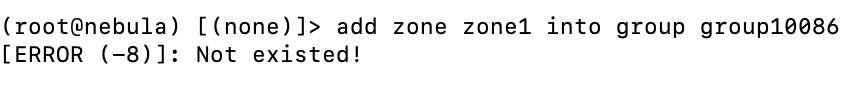

**GROUP STATUS** 

####DEBUG测试:GROUP中已存在目标ZONE

**命令**
add zone zone1 into group group1

**执行结果**
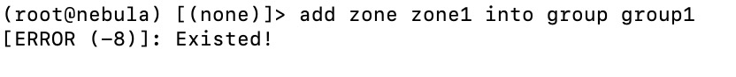

**GROUP STATUS** 

****
###DROP ZONE FROM GROUP
####命令测试
drop zone zone1 from group group1

**执行前GROUP STATUS** 

**执行结果**
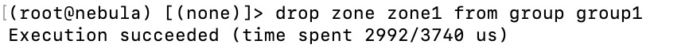

**执行后GROUP STATUS** 
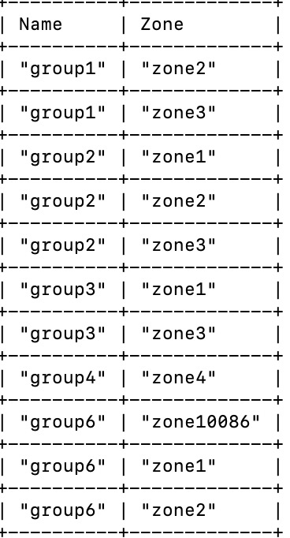

####DEBUG测试:DROP GROUP中一个不存在的ZONE

**命令**
drop zone zone10086 from group group1

**执行结果**
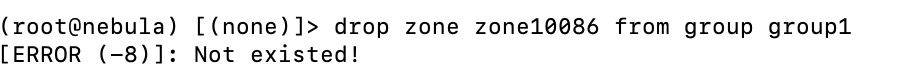

**GROUP STATUS** 

####DEBUG测试:将ZONE从一个不存在的GROUP DROP

**命令**
drop zone zone1 from group group65536

**执行结果**
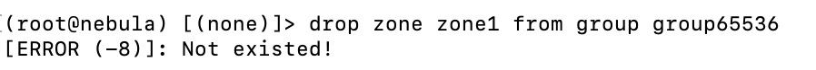

**GROUP STATUS** 
