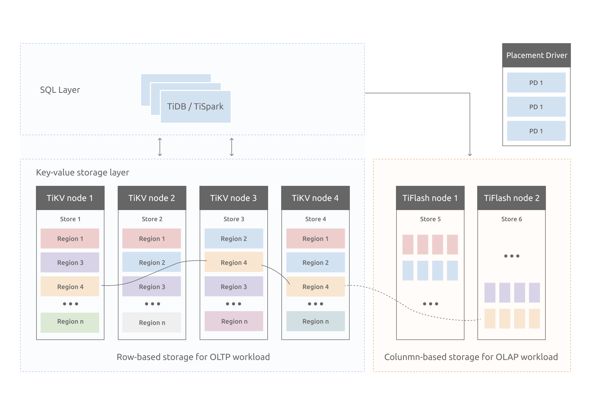

# TIDB

TI:Titanium(钛合金)。<font color="red">意义？？？？</font>

## 从特性入手理解tiDB

### 一键水平扩容或者水平缩容

得益于 TiDB 存储计算分离的架构的设计，可按需对计算、存储分别进行在线扩容或者缩容，扩容或者缩容过程中对应用运维人员透明。

疑问:<font color="red">如何实现扩容缩容？</font>

疑问:<font color="red">计算存储如何分离？</font>

### 金融级高可用

数据采用多副本存储，数据副本通过 Multi-Raft 协议同步事务日志，多数派写入成功事务才能提交，确保数据强一致性且少数副本发生故障时不影响数据的可用性。可按需配置副本地理位置、副本数量等策略满足不同容灾级别的要求.

疑问:<font color='red'>多副本如何在集群中分配？</font>

疑问:<font color="red">Multi-Raft协议是如何同步事务日志的？</font>

### 实时HTAP

提供行存储引擎 [TiKV](https://docs.pingcap.com/zh/tidb/stable/tikv-overview)、列存储引擎 [TiFlash](https://docs.pingcap.com/zh/tidb/stable/tiflash-overview) 两款存储引擎，TiFlash 通过 Multi-Raft Learner 协议实时从 TiKV 复制数据，确保行存储引擎 TiKV 和列存储引擎 TiFlash 之间的数据强一致。TiKV、TiFlash 可按需部署在不同的机器，解决 HTAP 资源隔离的问题。

疑问:<font color="red">两种存储引擎的基础架构？</font>

疑问:<font color='red'>HTAP是什么？它是如何进行资源隔离的？</font>

##  从TIDB架构学习TIDB

与传统的单机数据库相比，TiDB 具有以下优势：

- 纯分布式架构，拥有良好的扩展性，支持弹性的扩缩容
- 支持 SQL，对外暴露 MySQL 的网络协议，并兼容大多数 MySQL 的语法，在大多数场景下可以直接替换 MySQL
- 默认支持高可用，在少数副本失效的情况下，数据库本身能够自动进行数据修复和故障转移，对业务透明
- 支持 ACID 事务，对于一些有强一致需求的场景友好，例如：银行转账
- 具有丰富的工具链生态，覆盖数据迁移、同步、备份等多种场景


- TiDB Server：SQL 层，对外暴露 MySQL 协议的连接 endpoint，负责接受客户端的连接，执行 SQL 解析和优化，最终生成分布式执行计划。TiDB 层本身是无状态的，实践中可以启动多个 TiDB 实例，<font color='red'>**通过负载均衡组件（如 LVS、HAProxy 或 F5）对外提供统一的接入地址，客户端的连接可以均匀地分摊在多个 TiDB 实例上以达到负载均衡的效果**。</font>TiDB Server 本身并不存储数据，只是解析 SQL，将实际的数据读取请求转发给底层的存储节点 TiKV（或 TiFlash）。
- PD (Placement Driver) Server：整个 TiDB 集群的元信息管理模块，负责存储每个 TiKV 节点实时的数据分布情况和集群的整体拓扑结构，提供 TiDB Dashboard 管控界面，并为分布式事务分配事务 ID。PD 不仅存储元信息，同时还会根据 TiKV 节点实时上报的数据分布状态，下发数据调度命令给具体的 TiKV 节点，可以说是整个集群的“大脑”。此外，PD 本身也是由至少 3 个节点构成，拥有高可用的能力。建议部署奇数个 PD 节点。
- 存储节点
  - TiKV Server：负责存储数据，从外部看 TiKV 是一个分布式的提供事务的 Key-Value 存储引擎。存储数据的基本单位是 Region，每个 Region 负责存储一个 Key Range（从 StartKey 到 EndKey 的左闭右开区间）的数据，每个 TiKV 节点会负责多个 Region。TiKV 的 API 在 KV 键值对层面提供对分布式事务的原生支持，默认提供了 SI (Snapshot Isolation) 的隔离级别，这也是 TiDB 在 SQL 层面支持分布式事务的核心。TiDB 的 SQL 层做完 SQL 解析后，会将 SQL 的执行计划转换为对 TiKV API 的实际调用。所以，数据都存储在 TiKV 中。另外，TiKV 中的数据都会自动维护多副本（默认为三副本），天然支持高可用和自动故障转移。
  - TiFlash：TiFlash 是一类特殊的存储节点。和普通 TiKV 节点不一样的是，在 TiFlash 内部，数据是以列式的形式进行存储，主要的功能是为分析型的场景加速。

疑问:

## TIDB数据库的存储

TIKV:



模型：key-value模型

单机存储引擎：rocksDB

raft存储：在单机失效的情况下，如何保证数据不出错？

### Raft 协议

接下来 TiKV 的实现面临一件更难的事情：如何保证单机失效的情况下，数据不丢失，不出错？

简单来说，需要想办法把数据复制到多台机器上，这样一台机器无法服务了，其他的机器上的副本还能提供服务；复杂来说，还需要这个数据复制方案是可靠和高效的，并且能处理副本失效的情况。TiKV 选择了 Raft 算法。Raft 是一个一致性协议，本文只会对 Raft 做一个简要的介绍，细节问题可以参考它的[论文](https://raft.github.io/raft.pdf)。Raft 提供几个重要的功能：

- Leader（主副本）选举
- 成员变更（如添加副本、删除副本、转移 Leader 等操作）
- 日志复制

TiKV 利用 Raft 来做数据复制，每个数据变更都会落地为一条 Raft 日志，通过 Raft 的日志复制功能，将数据安全可靠地同步到复制组的每一个节点中。不过在实际写入中，根据 Raft 的协议，只需要同步复制到多数节点，即可安全地认为数据写入成功

分区：数据量大，如果不分区查询会导致慢，无法满足水平扩容缩容等问题。

## 计算

<font color="red">表数据是如何映射到key-value的？</font>

表数据:

```javascript
Key:   tablePrefix{TableID}_recordPrefixSep{RowID}
Value: [col1, col2, col3, col4]
```

主键索引:

```rust
Key:   tablePrefix{tableID}_indexPrefixSep{indexID}_indexedColumnsValue
Value: RowID
```

普通索引:

```
Key:   tablePrefix{TableID}_indexPrefixSep{IndexID}_indexedColumnsValue_{RowID}
Value: null
```

