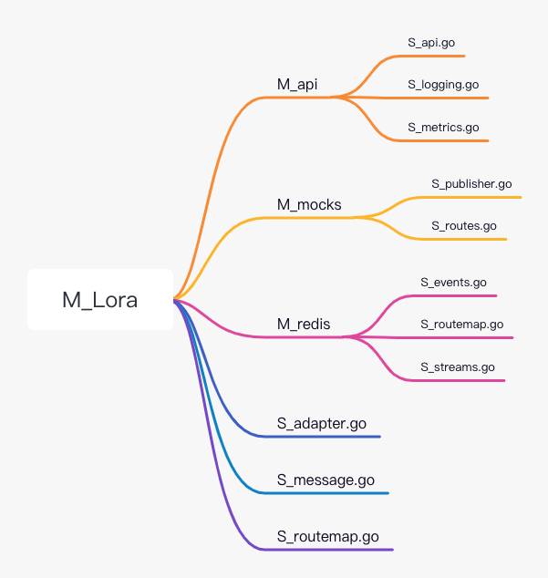
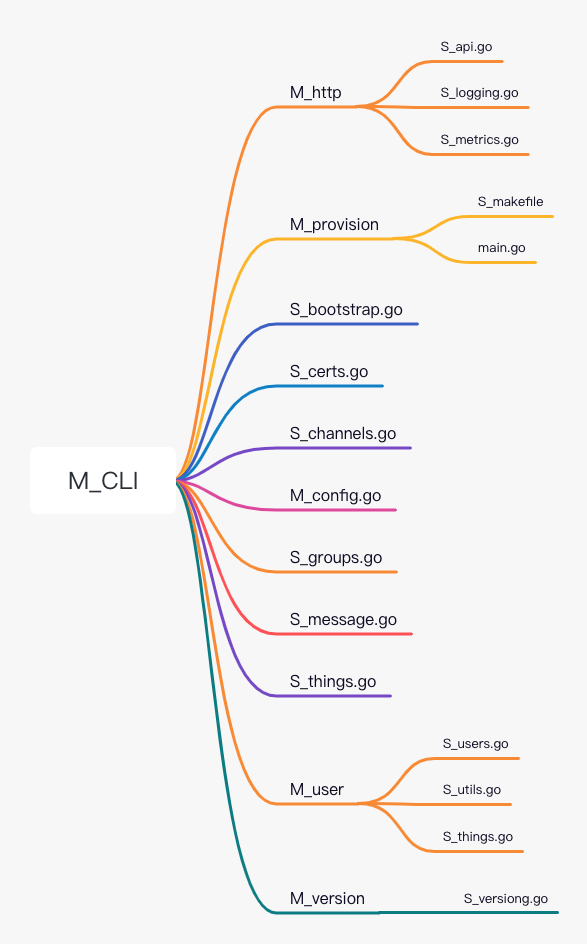
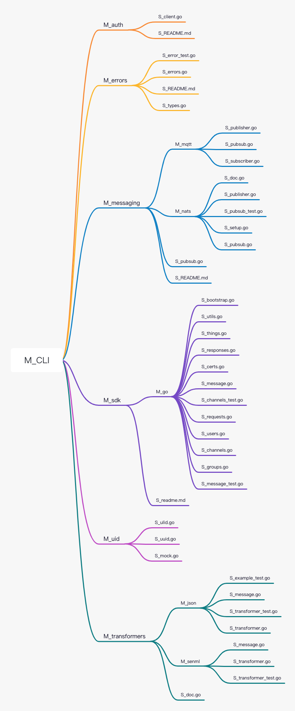
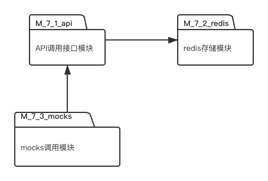
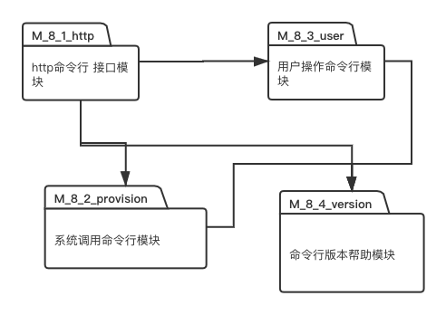
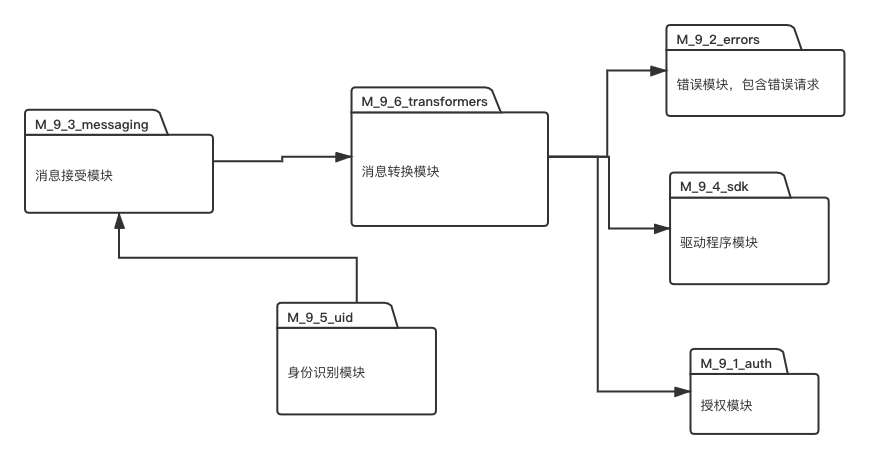
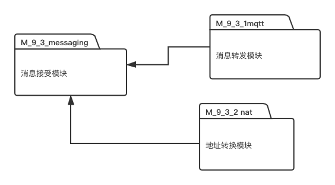
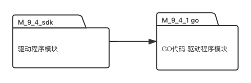
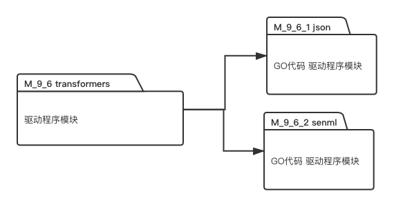

[toc]

# 1. 软件系统简介

## 1.1 软件系统的主要功能介绍

Mainflux 是一种现代化的、高度安全的、开源的和专利免费的的物联网云平台。它使用 Golang 编写，基于一组微服务，允许使用各种网络协议（如 HTTP、MQTT、WebSocket 和 CAAP）的设备、用户和应用程序进行连接，并在它们之间作无缝桥接。

Mainflux 一般被用作构建复杂物联网解决方案的物联网中间件。 正如大多数物联网平台系统一样，Mainflux 公开了南向 API 来连接设备和北向 API 来连接应用程序，然后允许它们之间的消息路由。 整个系统（设备、MainFlux 平台和应用）一起形成所谓的“垂直解决方案（vertical solution）“，它具体依赖于给定的用例。

上图描绘了一个典型的物联网系统，从中可以看出 Mainflux 位于整体架构中的核心位置。 物联网产品的设计者可以重用此块并仅重点关注最左侧连接物理设备的部分，和最右侧连接用户应用程序，也就是起控制作用的 GUI 应用程序、设备的部分。

Mainflux 将以高度安全的方式将设备和应用程序和中继消息连接，同时提供设备和应用程序管理所需的许多其他服务。

用通常的描述物联网系统的术语来说，Mainflux 提供了具有分布式时间序列（time-series）数据存储和多用户、多租用设备（multitenant device）和应用程序管理中间件的多协议设备无关的消息中继器。

## 1.2 软件系统的代码行数

软件系统的代码行数如上图所示，大约 70 万行，占比最大的语言是 Golang，大约 66 万行。

## 1.3 软件系统中包和类的数量

# 2. 需求分析

## 2.1 软件系统的功能需求

## 2.2 软件系统的主要质量属性

## 2.3 其他设计时需考虑的需求

# 3. 软件体系结构分析与恢复

## 3.1 软件体系结构的恢复和建模

### 3.1.1 软件体系结构的模块及功能描述

#### 3.1.1.4 M_4_mqtt

MQTT（Message Queuing Telemetry Transport，消息队列遥测传输协议），是一种基于发布/订阅（publish/subscribe）模式的"轻量级"通讯协议，该协议构建于 TCP/IP 协议上，由 IBM 在 1999 年发布。MQTT 最大优点在于，可以以极少的代码和有限的带宽，为连接远程设备提供实时可靠的消息服务。作为一种低开销、低带宽占用的即时通讯协议，使其在物联网、小型设备、移动应用等方面有较广泛的应用。

MQTT 是一个基于客户端-服务器的消息发布/订阅传输协议。MQTT 协议是轻量、简单、开放和易于实现的，这些特点使它适用范围非常广泛。在很多情况下，包括受限的环境中，如：机器与机器（M2M）通信和物联网（IoT）。其在，通过卫星链路通信传感器、偶尔拨号的医疗设备、智能家居、及一些小型化设备中已广泛使用。

- M_4_1_redis

这个子模块提供了 cache 功能，底层采用的是 Redis 作为存储。

events.go 文件定义了 `mqttEvent` 结构体，以及它对应的 `Encode()` 方法。`mqttEvent` 结构体用于记录一个 MQTT 事件，`Encode()` 方法用于将一个 `mqttEvent` 类型的 MQTT 事件转换成 `map` 类型的变量。

streams.go 文件定义了 `EventStore` 结构体，用于在 Redis 中存储事件流。`NewEventStore` 函数会生成 `EventStore`。`storeEvent` 负责将事件转换成 `mqttEvent`，并存储到 Redis 中。

- M_4_2_mqtt

这个子模块提供一个 MQTT API，用于在平台发送消-息。该模块使用 [mProxy](https://github.com/mainflux/mproxy) 来作为客户端和 MQTT broker 之间 proxy 技术。我们可以使用一系列环境变量来作为服务的配置。这个模块使用 Docker 进行部署运行。

#### 3.1.1.5 M_5_coap

#### 3.1.1.6 M_6_opcua
#### 3.1.1.7 M_7 lora 数据推送模块

**功能描述**
LoRa Server 用于连接层，数据通过这个适配器服务推送到 Mainflux，在那里它被持久化并通过 Mainflux 多协议消息代理路由到其他协议。 Mainflux 增加了用户帐户、应用程序管理和安全性，以获得整体的端到端 LoRa 解决方案。

- 子模块 M_7_1 api调用模块

**功能描述**

API就是操作系统给应用程序的调用接口，应用程序通过调用操作系统的 API而使操作系统去执行应用程序的命令（动作）。在数据推送模块中，api模块提供从对mocks模块到redis存储模块的调用接口。

- 子模块 M_7_2 redis存储模块

**功能描述**
redis模块将mocks模块所推送到mainflux的信息，数据等，以nosql的形式存储，其内部的存储结构是用的key-value存储。主要的特点有:

- 基于内存运行，性能高效

- 支持分布式，理论上可以无限扩展

- key-value存储系统

- 开源的使用ANSI C语言编写、遵守BSD协议、支持网络、可基于内存亦可持久化的日志型、Key-Value数据库，并提供多种语言的API
- 子模块 M_7_3 mocks调用模块

**功能描述**
主要是针对单元测试的应用，它可以很方便的解除单元测试中各种依赖，大大的降低了编写单元测试的难度。

#### 3.1.1.8 M_8_命令行接口模块
**功能描述**
提供mainflux通过物联网对于用户，系统的命令行接口。
- 子模块 M_8_1 http调用模块
**功能描述**
http调用模块把相关命令转换成为http调用命令，然后在系统调用接口执行该http调用，以命令行的方式执行该http调用，再把返回报文，返回状态码等相关信息返还给相关用户进程（物联网设备）。
- 子模块 M_8_2 系统调用命令行模块
**功能描述**
系统调用命令行模块，操作系统中的状态分为管态（核心态）和目态（用户态）。特权指令：一类只能在核心态下运行而不能在用户态下运行的特殊指令。不同的操作系统特权指令会有所差异，但是一般来说主要是和硬件相关的一些指令。用户程序只在用户态下运行，有时需要访问系统核心功能，这时通过系统调用接口使用系统调用。此模块的意义即是提供给用户mainflux系统调用的接口。

- 子模块 M_8_3 用户态命令命令行模块
**功能描述**
操作系统在用户态时也能执行不同的命令行调用，此模块的功能就是给用户提供在用户为操作系统的用户态时使用的命令行指令的接口。
- 子模块 M_8_4 版本 版本，帮助查询模块
**功能描述**
此命令用于查询目前命令行接口的版本，以及相关的命令行接口命令的帮助描述。

#### 

####  3.1.1.9 M_9 pkg 系统相关包模块
**功能描述**
pkg模块包含一组可以被外部应用程序导入和使用的独立包。 这些软件包专门用于开发基于 Mainflux 的后端应用程序，并实现 Mainflux 平台编程操作所需的常见任务。

- 子模块 M_9_1_授权模块

  **功能描述**

  授权模块包用于识别物联网中的物并授权物的访问通道。

  要识别事物，您需要一个有效的 **密钥**。 您以**事物 ID** 的形式检索事物的身份。 后者用于对事物及其连接的 CRUD 操作。
  
- 子模块 M_9_2_error模块
  **功能描述**
  
  错误模块用于构建任意长的错误链，用来捕获在物联网事务中错误的请求。
  
- 子模块 M_9_3消息模块

  **功能描述**

  消息接受模块定义了 `Publisher`、`Subscriber` 和一个聚合的 `Pubsub` 接口。

  `Subscriber` 接口定义了用于订阅消息代理（例如 MQTT 或 NATS）的方法。

  `Publisher` 接口定义了用于将消息发布到消息代理（例如 MQTT 或 NATS）的方法。

   - 子模块 M_9_3_1 mqtt模块

     **功能描述**

     MQTT是一个基于客户端-服务器的消息发布/订阅传输协议模块。

     

   - 子模块 M_9_3_2 地址转换模块

     **功能描述**

     地址转换模块使用的是动态地址转换，因为物联网设备很多，但网络地址空间却不足。

     动态转换是指将内部网络的私有IP地址转换为公用IP地址时，IP地址是不确定的，是随机的，所有被授权访问上Internet的私有IP地址可随机转换为任何指定的合法IP地址。也就是说，只要指定哪些内部地址可以进行转换，以及用哪些合法地址作为外部地址时，就可以进行动态转换。动态转换可以使用多个合法外部地址集。当提供的合法IP地址略少于网络内部的计算机数量时，可以采用动态转换的方式。
  
- 子模块 M_9_4 驱动包模块

  **功能描述**

  此模块包含 Mainflux HTTP API 的驱动程序，而且驱动程序是用不同的语言编写的，以便能够以相应的语言更快地开发应用程序。 驱动程序促进系统管理 - 对事物、通道及其连接的 CRUD 操作，即提供 Mainflux 实体。 它们也可用于消息传递。

  - 子模块 M_9_1 GO驱动包模块

    **功能描述**

    此模块用来描述GO语言的扩展驱动程序，同时也昭示着可以使用其他语言的驱动程序包。
  
- 子模块 M_9_5 身份识别模块

  **功能描述**

  uuid.go表示身份提供者生成一个随机的、通用的唯一标识符 (UUID)，对于所有实际用途都是唯一的，这个id为数字。

  ulid.go表示身份提供者生成一个普遍唯一的按字典排序的字符串编码标识符，一个 128 位数字，对于所有实际用途都是唯一的。
  一个。

  按照任意一个id都能找到唯一一个物联网应用。

- 子模块 M_9_6 消息转换模块

  **功能描述**

  转换器模块使用 Mainflux 适配器（例如 MQTT 和 HTTP 适配器）发布的事件并将它们转换为任意消息格式。 

  - 子模块 M_9_6_1 json消息转换模块

    **功能描述**

    JSON建构于两种结构：

    1. “名称/值”对的集合（A collection of name/value pairs）。不同的语言中，它被理解为对象（object），记录（record），结构（struct），字典（dictionary），哈希表（hash table），有键列表（keyed list），或者关联数组 （associative array）。

    2. 值的有序列表（An ordered list of values）。在大部分语言中，它被理解为数组（array）。

    JSON Transformer 为 JSON 消息提供消息转换器。即把json格式转换为mainflux消息格式
    
  - 子模块 M_9_6_2  senml消息转换模块
  
    **功能描述**
  
    SenML Transformer 为 SenML 消息提供 Message Transformer。
    它支持 JSON 和 CBOR 内容类型 - 要成功转换 Mainflux 消息，有效负载必须是 JSON 或 CBOR 编码的 SenML 消息。

### 3.1.2 文件目录树

#### 3.1.2.4 M_4_mqtt

#### 3.1.2.7 M_7 lora 数据推送模块

#### 3.1.2.8 M_8_命令行接口模块

#### 3.1.2.9 M_9 pkg 系统相关包模块

### 3.1.3 模块关系图

- 2-M_4-模块关系图

-  2-M_7-模块关系图
 
-  2-M_8-模块关系图
  
-  2-M_9-模块关系图
  
-  3-M_9_3-模块关系图
  
-  3-M_9_4-模块关系图
  
-  3-M_9_6-模块关系图
  